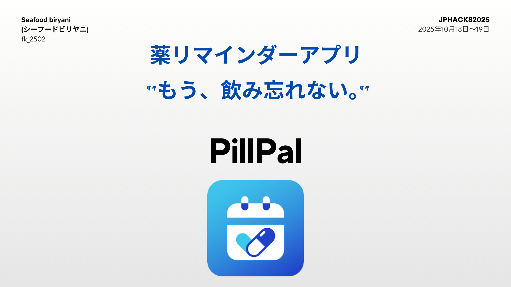
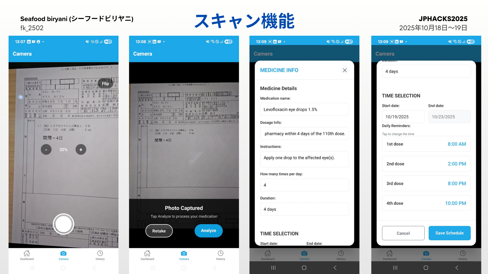
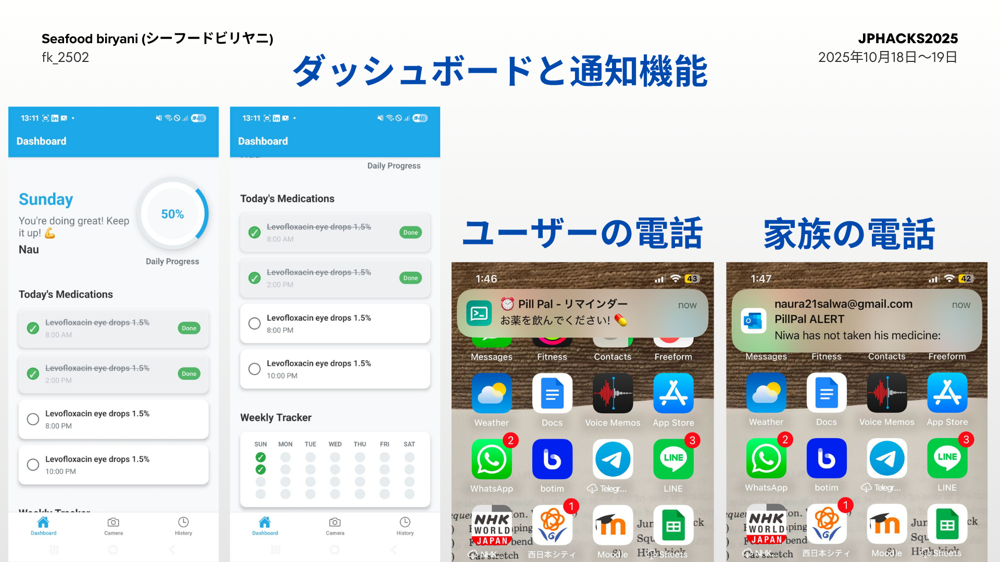
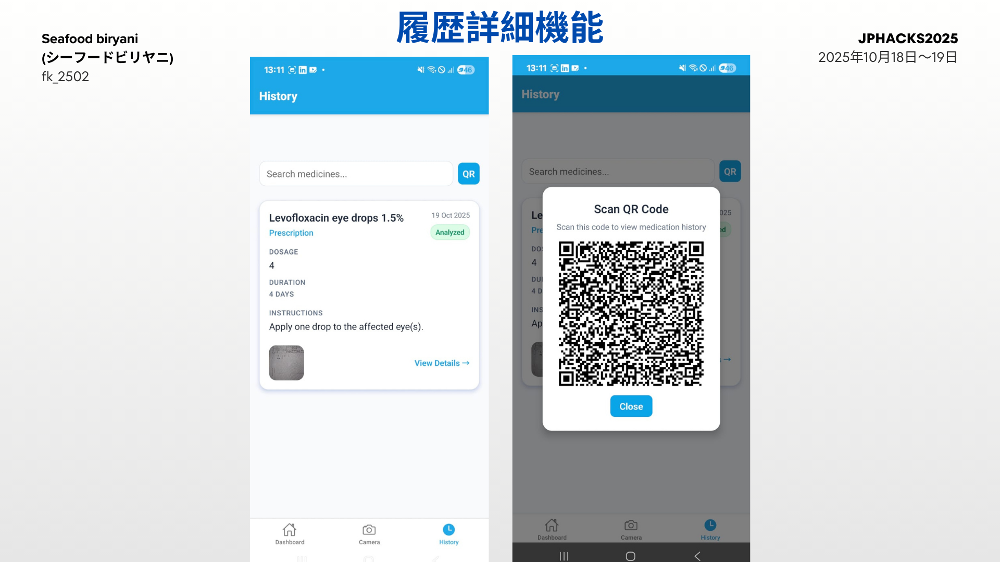

# PillPal (ピルパル) 💊

## アプリケーションデモ
https://www.youtube.com/watch?v=32WarQNLVqs
[](https://youtu.be/32WarQNLVqs)

薬の飲み忘れは誰にでもあることです。PillPalは、処方箋をスキャンするだけで服薬を簡単に思い出せる、スマートなリマインダーアプリです。






## 解決したい課題 🤔

* 忙しい生活の中で、時間通りに薬を飲むのを忘れがちで、それが健康状態を悪化させることがあります。
* 新しいクリニック（病院）にかかるとき、自分の服薬履歴をすべて正確かつ迅速に共有するのは困難です。
* 家族は、離れて暮らす大切な人が指示通りに処方薬を飲んでいるか、常に心配しています。

PillPalは、これらの問題をシンプルなオールインワン・ソリューションで解決するために開発されました。

## PillPalができること ✅

PillPalは、処方箋の管理をシームレスにする服薬追跡アプリです。

処方箋の写真を撮るだけで、アプリが自動的に薬品名、用量、スケジュールを抽出します。そしてリマインダーを設定し、あなたの服薬履歴をデジタル記録として保存します。この履歴は、簡単なQRコードを使ってどの医師とでも即座に共有できます。

また、飲み忘れた場合には家族に通知し、信頼できるサポートシステムを構築します。

## ✨ 主な機能

* **📸 AI処方箋スキャナー:** 処方箋の写真を撮るだけ。Gemini Vision AIがテキストを読み取り、詳細を理解します。
* **🗓️ 自動カレンダー＆トラッカー:** 服薬スケジュールが自動的にカレンダーに追加されます。アプリで直接、服薬履歴を追跡できます。
* **🔔 スマート通知:** 薬を飲む時間になると、プッシュ通知が届きます。
* **👨👩👧 家族へのアラート:** 家族のメールアドレスを登録できます。もし薬を飲み忘れると、家族にメール通知が届き、あなたの様子を確認できます。
* **⚕️ 医師向けQRコード:** あなたの服薬履歴は保存され、即座にQRコードとして生成できます。新しいクリニックで医師にこれを見せるだけで、迅速かつ正確に履歴を共有できます。
* **⚡ 軽量＆高速:** アプリはサーバーサイドレンダリング（SSR）を採用。重い処理はすべてサーバー側で行うため、古いスマートフォンでも高速かつ快適に動作します。

## 💻 使用技術

* **アプリフレームワーク:** React Native
* **バックエンド:** Flask
* **データベース:** Firebase & ChromaDB
* **AI・スキャン:** Gemini Vision AI, Gemini Embeddings, Langchain
* **通知システム:** `ntfy` (プッシュ通知), `smtplib` (Eメール)

## 使い方 (How to Use)

### 1. 環境設定 (Environment Setup)

`API` フォルダに `.env` ファイルを作成し、お使いのGemini APIキーを `GEMINI_API_KEY` という名前で保存してください。


GEMINI\_API\_KEY="YOUR\_API\_KEY\_HERE"


### 2. APIサーバーの起動 (Starting the API Server)

1.  `API` フォルダに移動します。
2.  `embed-files.py` を実行して、医薬品情報のベクトルデータベースを作成します（データソースは `meds-info.json` です）。

    ```bash
    python embed-files.py
    ```

3.  次に、`flask-api.py` を実行してサーバーを起動します。

    ```bash
    python flask-api.py
    ```

### 3. アプリの起動 (Starting the App)

1.  お使いのスマートフォンに **Expo Go** アプリをダウンロードします。
2.  プロジェクトのルートディレクトリで、以下のコマンドを実行します。

    ```bash
    npx expo start --tunnel
    ```

3.  ターミナルに表示されたQRコードをExpo Goアプリでスキャンすると、スマートフォンでアプリが起動します。
